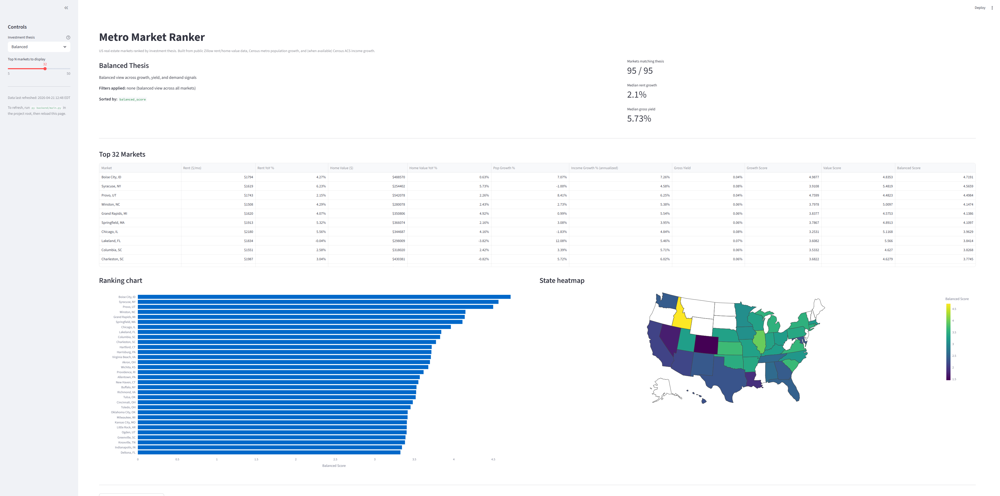

# Metro Market Ranker
**Live demo:** https://metro-market-ranker.streamlit.app
An interactive dashboard that ranks US real estate metros by investment thesis, combining Zillow rent and home-value data with Census population and income growth.

## What it does

Pulls four public datasets, normalizes them to a common metro (CBSA) key, scores every market on growth / value / balanced composites, and lets you filter by investment thesis:

- **Balanced** — default view across all signals
- **Yield** — high cashflow markets (gross yield > 7%)
- **Growth** — population and rent growth leaders
- **Affordability** — rising incomes and reasonable prices
- **Contrarian** — discounted home values with decent yield

## Data sources

- **Zillow Research** — ZORI (Zillow Observed Rent Index) and ZHVI (Zillow Home Value Index), monthly metro-level
- **US Census Bureau** — CBSA Population Estimates (vintage 2023)
- **US Census ACS 5-Year** — Median household income (B19013_001E), 2019 vs 2024

All sources are public and no API keys are required.

## How it works